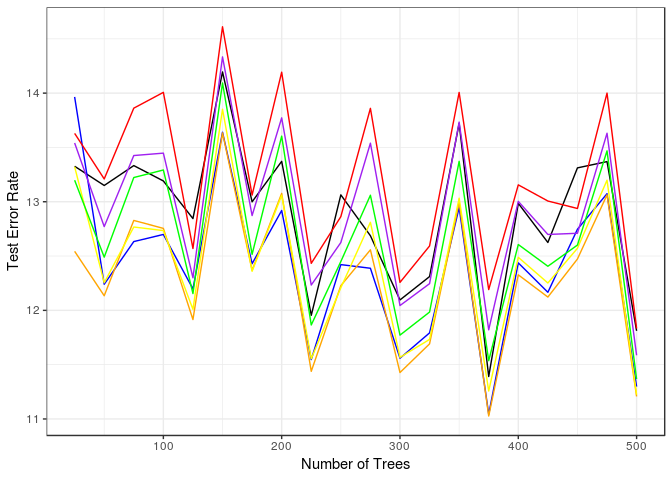
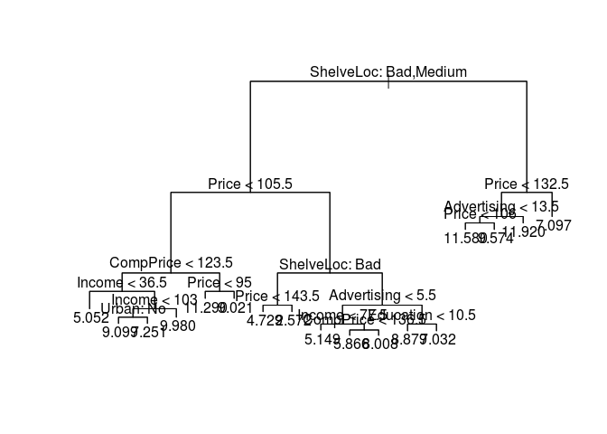
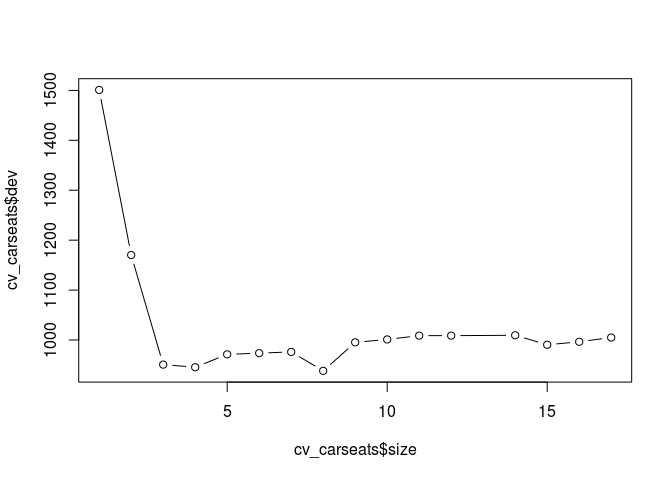
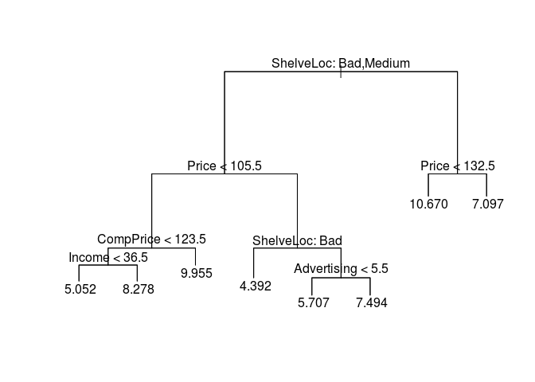
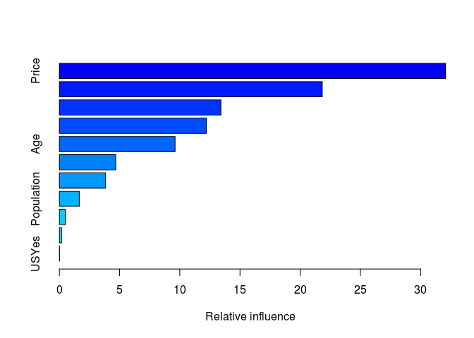

Homework 4: Bags, Forests, Boosts, oh my
================
Skylar White
2/28/2019

``` r
library(tidyverse)
```

    ## ── Attaching packages ───────────────────────────────────────────────────────────────────────────── tidyverse 1.2.1 ──

    ## ✔ ggplot2 3.0.0     ✔ purrr   0.2.5
    ## ✔ tibble  1.4.2     ✔ dplyr   0.7.6
    ## ✔ tidyr   0.8.1     ✔ stringr 1.3.1
    ## ✔ readr   1.1.1     ✔ forcats 0.3.0

    ## ── Conflicts ──────────────────────────────────────────────────────────────────────────────── tidyverse_conflicts() ──
    ## ✖ dplyr::filter() masks stats::filter()
    ## ✖ dplyr::lag()    masks stats::lag()

``` r
library(ggplot2)
library(ISLR)
library(tree)
library(caret)
```

    ## Loading required package: lattice

    ## 
    ## Attaching package: 'caret'

    ## The following object is masked from 'package:purrr':
    ## 
    ##     lift

``` r
library(stringr)
library(rpart)
library(rpart.plot)
library(partykit)
```

    ## Loading required package: grid

    ## Loading required package: libcoin

    ## Loading required package: mvtnorm

``` r
theme_set(theme_bw())
theme_set(theme_bw())
```

Problem 1
---------

Problem 7 from Chapter 8 in the text. To be specific, please use a sequence of `ntree` from 25 to 500 in steps of 25 and `mtry` from 3 to 9 for by 1.

In the lab, we applied random forests to the Boston data using mtry=6 and using ntree=25 and ntree=500. Create a plot displaying the test error resulting from random forests on this data set for a more comprehensive range of values for mtry and ntree. You can model your plot after Figure 8.10. Describe the results obtained. \#\# Answer 1

``` r
library(MASS)
```

    ## 
    ## Attaching package: 'MASS'

    ## The following object is masked from 'package:dplyr':
    ## 
    ##     select

``` r
library(randomForest)
```

    ## randomForest 4.6-14

    ## Type rfNews() to see new features/changes/bug fixes.

    ## 
    ## Attaching package: 'randomForest'

    ## The following object is masked from 'package:dplyr':
    ## 
    ##     combine

    ## The following object is masked from 'package:ggplot2':
    ## 
    ##     margin

``` r
set.seed(1)
train = sample(1:nrow(Boston), nrow(Boston)/2)
boston.test=Boston[-train,"medv"]
```

``` r
set.seed(1)
rf.boston= randomForest(medv~.,data=Boston, subset=train,
mtry=6, importance =TRUE)
yhat.rf = predict(rf.boston ,newdata=Boston[-train,])
mean((yhat.rf-boston.test)^2)
```

    ## [1] 11.66454

``` r
rf.boston
```

    ## 
    ## Call:
    ##  randomForest(formula = medv ~ ., data = Boston, mtry = 6, importance = TRUE,      subset = train) 
    ##                Type of random forest: regression
    ##                      Number of trees: 500
    ## No. of variables tried at each split: 6
    ## 
    ##           Mean of squared residuals: 11.8888
    ##                     % Var explained: 85.6

``` r
set.seed(1234)
df <- tbl_df(Boston)
inTraining <- createDataPartition(df$medv, p = .75, list = F)
training <- df[inTraining, ]
testing  <- df[-inTraining, ]

results <- data_frame(ntree = seq(25, 500, by = 25),
                      mtry_3 = rep(NA, length(ntree)),
                      mtry_4 = rep(NA, length(ntree)),
                      mtry_5 = rep(NA, length(ntree)),
                      mtry_6 = rep(NA, length(ntree)),
                      mtry_7 = rep(NA, length(ntree)),
                      mtry_8 = rep(NA, length(ntree)),
                      mtry_9 = rep(NA, length(ntree)))

for (i in 1:20){
rf_boston_cv <- train(medv~., 
                      data = training,
                      method = "rf",
                      ntree = results$ntree[i],
                      importance = T,
                      tuneGrid = data.frame(mtry = 3:9))
results[i, 2:8] <- rf_boston_cv$results$RMSE^2}
```

``` r
ggplot(data = results, 
            aes(x = ntree)) + 
  geom_line(aes(y = mtry_3), color = "black")+
  geom_line(aes(y = mtry_4), color = "blue") +
  geom_line(aes(y = mtry_5), color = "orange")+
  geom_line(aes(y = mtry_6), color = "yellow")+
  geom_line(aes(y = mtry_7), color = "green")+
  geom_line(aes(y = mtry_8), color = "purple")+
  geom_line(aes(y = mtry_9), color = "red")+
  ylab(label="Test Error Rate") + 
  xlab("Number of Trees")
```



Problem 2
---------

Problem 8 from Chapter 8 in the text. Set your seed with 9823 and split into train/test using 50% of your data in each split. In addition to parts (a) - (e), do the following:

1.  Fit a gradient-boosted tree to the training data and report the estimated test MSE.
2.  Fit a multiple regression model to the training data and report the estimated test MSE
3.  Summarize your results.

In the lab, a classification tree was applied to the Carseats data set after converting Sales into a qualitative response variable. Now we will seek to predict Sales using regression trees and related approaches, treating the response as a quantitative variable. (a) Split the data set into a training set and a test set.

``` r
set.seed(9823)
df <- tbl_df(Carseats)
train <- sample(1:nrow(Carseats), nrow(Carseats) / 2)
training <- Carseats[train, ]
testing <- Carseats[-train, ]
```

1.  Fit a regression tree to the training set. Plot the tree, and interpret the results. What test error rate do you obtain?

``` r
carseats_tree <- tree(Sales ~ ., data = training)
summary(carseats_tree)
```

    ## 
    ## Regression tree:
    ## tree(formula = Sales ~ ., data = training)
    ## Variables actually used in tree construction:
    ## [1] "ShelveLoc"   "Price"       "CompPrice"   "Income"      "Urban"      
    ## [6] "Advertising" "Education"  
    ## Number of terminal nodes:  17 
    ## Residual mean deviance:  2.083 = 381.1 / 183 
    ## Distribution of residuals:
    ##    Min. 1st Qu.  Median    Mean 3rd Qu.    Max. 
    ## -3.7810 -0.8101  0.0360  0.0000  0.7387  4.5230

``` r
plot(carseats_tree)
text(carseats_tree, pretty = 0)
```



``` r
yhat <- predict(carseats_tree, newdata = testing)
mean((yhat - testing$Sales)^2)
```

    ## [1] 4.959247

1.  Use cross-validation in order to determine the optimal level of tree complexity. Does pruning the tree improve the test error rate?

``` r
cv_carseats <- cv.tree(carseats_tree)
plot(cv_carseats$size, cv_carseats$dev, type = "b")
```



``` r
tree.min <- which.min(cv_carseats$dev)
```

``` r
prune_carseats <- prune.tree(carseats_tree, best = 8)
plot(prune_carseats)
text(prune_carseats, pretty = 0)
```



``` r
yhat <- predict(prune_carseats, newdata = testing)
mean((yhat - testing$Sales)^2)
```

    ## [1] 5.427844

No, it increases it.

1.  Use the bagging approach in order to analyze this data. What test error rate do you obtain? Use the importance() function to determine which variables are most important. 334 8. Tree-Based Methods

``` r
bag_carseats <- randomForest(Sales ~ ., data = training, mtry = 10, ntree = 500, importance = TRUE)
yhat_bag <- predict(bag_carseats, newdata = testing)
mean((yhat_bag - testing$Sales)^2)
```

    ## [1] 3.070469

``` r
importance(bag_carseats)
```

    ##                %IncMSE IncNodePurity
    ## CompPrice   20.1313623    136.541449
    ## Income      10.1092945     88.744497
    ## Advertising 21.3696744    157.546184
    ## Population  -0.7697326     57.649051
    ## Price       56.9192838    435.458106
    ## ShelveLoc   53.5959158    398.022072
    ## Age         10.0190133    105.183801
    ## Education    2.8224785     40.620529
    ## Urban        1.1687302      8.867456
    ## US           3.6948053      8.606905

1.  Use random forests to analyze this data. What test error rate do you obtain? Use the importance() function to determine which variables are most important. Describe the effect of m, the number of variables considered at each split, on the error rate obtained.

``` r
rf_carseats <- randomForest(Sales ~ ., data = training, mtry = 3, ntree = 500, importance = TRUE)
yhat_rf <- predict(rf_carseats, newdata = testing)
mean((yhat_rf - testing$Sales)^2)
```

    ## [1] 3.53684

Having m= root(p) makes the error rate relatively high compared with bagging.

``` r
importance(rf_carseats)
```

    ##                 %IncMSE IncNodePurity
    ## CompPrice   12.05564087     123.16101
    ## Income       5.06266664     117.40845
    ## Advertising 17.84332472     169.98603
    ## Population  -0.92383513     104.58861
    ## Price       39.01410528     351.91456
    ## ShelveLoc   38.64399472     308.26756
    ## Age          9.07462256     137.91384
    ## Education    0.79147863      51.68103
    ## Urban       -0.06851421      13.21907
    ## US           2.54250310      20.77722

1.  Fit a gradient-boosted tree to the training data and report the estimated test MSE.

``` r
set.seed(9823)
grid <- expand.grid(interaction.depth = c(1, 3), 
                    n.trees = seq(0, 2000, by = 100),
                    shrinkage = c(.01, 0.001),
                    n.minobsinnode = 10)
trainControl <- trainControl(method = "cv", number = 5)
gbm_Carseats <- train(Sales~., 
                    data = training, 
                    distribution = "gaussian", 
                    method = "gbm",
                    trControl = trainControl, 
                    tuneGrid = grid,
                    verbose = FALSE)
```

    ## Warning in nominalTrainWorkflow(x = x, y = y, wts = weights, info =
    ## trainInfo, : There were missing values in resampled performance measures.

``` r
gbm_Carseats
```

    ## Stochastic Gradient Boosting 
    ## 
    ## 200 samples
    ##  10 predictor
    ## 
    ## No pre-processing
    ## Resampling: Cross-Validated (5 fold) 
    ## Summary of sample sizes: 160, 160, 160, 160, 160 
    ## Resampling results across tuning parameters:
    ## 
    ##   shrinkage  interaction.depth  n.trees  RMSE      Rsquared   MAE     
    ##   0.001      1                     0     2.704981        NaN  2.237165
    ##   0.001      1                   100     2.663862  0.2840407  2.201393
    ##   0.001      1                   200     2.623293  0.3030511  2.165553
    ##   0.001      1                   300     2.585707  0.3287532  2.131952
    ##   0.001      1                   400     2.549209  0.3507542  2.100334
    ##   0.001      1                   500     2.512868  0.3755549  2.068770
    ##   0.001      1                   600     2.481114  0.3855423  2.041098
    ##   0.001      1                   700     2.449413  0.3945383  2.014021
    ##   0.001      1                   800     2.420556  0.4039178  1.988829
    ##   0.001      1                   900     2.393336  0.4124239  1.964719
    ##   0.001      1                  1000     2.366247  0.4226747  1.940066
    ##   0.001      1                  1100     2.339490  0.4336186  1.915712
    ##   0.001      1                  1200     2.315314  0.4426261  1.893199
    ##   0.001      1                  1300     2.293429  0.4496873  1.871938
    ##   0.001      1                  1400     2.271105  0.4567693  1.850909
    ##   0.001      1                  1500     2.249716  0.4627158  1.831910
    ##   0.001      1                  1600     2.229536  0.4681436  1.814976
    ##   0.001      1                  1700     2.212235  0.4722015  1.799698
    ##   0.001      1                  1800     2.194497  0.4760521  1.783438
    ##   0.001      1                  1900     2.178320  0.4812184  1.769523
    ##   0.001      1                  2000     2.162437  0.4863721  1.755358
    ##   0.001      3                     0     2.704981        NaN  2.237165
    ##   0.001      3                   100     2.619877  0.4563826  2.162441
    ##   0.001      3                   200     2.541309  0.4910294  2.095695
    ##   0.001      3                   300     2.471278  0.5032890  2.034762
    ##   0.001      3                   400     2.408536  0.5136094  1.980698
    ##   0.001      3                   500     2.350932  0.5241431  1.930017
    ##   0.001      3                   600     2.299269  0.5320527  1.883345
    ##   0.001      3                   700     2.251485  0.5419762  1.841228
    ##   0.001      3                   800     2.207299  0.5523404  1.802514
    ##   0.001      3                   900     2.165179  0.5624075  1.765897
    ##   0.001      3                  1000     2.127396  0.5709005  1.733372
    ##   0.001      3                  1100     2.092020  0.5775129  1.703036
    ##   0.001      3                  1200     2.057204  0.5868227  1.673926
    ##   0.001      3                  1300     2.024912  0.5954411  1.645733
    ##   0.001      3                  1400     1.994871  0.6042243  1.619799
    ##   0.001      3                  1500     1.967681  0.6099881  1.595878
    ##   0.001      3                  1600     1.942555  0.6154587  1.573247
    ##   0.001      3                  1700     1.917349  0.6220553  1.550664
    ##   0.001      3                  1800     1.894071  0.6280319  1.529280
    ##   0.001      3                  1900     1.872041  0.6335827  1.509174
    ##   0.001      3                  2000     1.850945  0.6384524  1.490188
    ##   0.010      1                     0     2.704981        NaN  2.237165
    ##   0.010      1                   100     2.356873  0.4242163  1.927543
    ##   0.010      1                   200     2.168533  0.4753274  1.759947
    ##   0.010      1                   300     2.031259  0.5324347  1.639508
    ##   0.010      1                   400     1.926774  0.5727310  1.544857
    ##   0.010      1                   500     1.840790  0.6086785  1.470667
    ##   0.010      1                   600     1.766171  0.6376036  1.412110
    ##   0.010      1                   700     1.696738  0.6641256  1.356420
    ##   0.010      1                   800     1.640296  0.6831617  1.311282
    ##   0.010      1                   900     1.588204  0.7002872  1.267698
    ##   0.010      1                  1000     1.544983  0.7117253  1.231577
    ##   0.010      1                  1100     1.507368  0.7209506  1.201420
    ##   0.010      1                  1200     1.475990  0.7283355  1.175976
    ##   0.010      1                  1300     1.445631  0.7360490  1.152758
    ##   0.010      1                  1400     1.422025  0.7410740  1.135779
    ##   0.010      1                  1500     1.400176  0.7460428  1.120000
    ##   0.010      1                  1600     1.380493  0.7503440  1.105186
    ##   0.010      1                  1700     1.366705  0.7538552  1.094006
    ##   0.010      1                  1800     1.351909  0.7576977  1.082324
    ##   0.010      1                  1900     1.341407  0.7601308  1.074895
    ##   0.010      1                  2000     1.334527  0.7612892  1.068876
    ##   0.010      3                     0     2.704981        NaN  2.237165
    ##   0.010      3                   100     2.123002  0.5669301  1.733233
    ##   0.010      3                   200     1.850919  0.6418513  1.497462
    ##   0.010      3                   300     1.671409  0.6887063  1.340114
    ##   0.010      3                   400     1.556548  0.7123549  1.254670
    ##   0.010      3                   500     1.470665  0.7325553  1.196623
    ##   0.010      3                   600     1.422087  0.7418434  1.160849
    ##   0.010      3                   700     1.388814  0.7482103  1.132033
    ##   0.010      3                   800     1.365309  0.7523001  1.109292
    ##   0.010      3                   900     1.352133  0.7543468  1.096037
    ##   0.010      3                  1000     1.347524  0.7542752  1.092286
    ##   0.010      3                  1100     1.339587  0.7556635  1.082249
    ##   0.010      3                  1200     1.339048  0.7546594  1.081106
    ##   0.010      3                  1300     1.339631  0.7535897  1.081229
    ##   0.010      3                  1400     1.339397  0.7528368  1.079252
    ##   0.010      3                  1500     1.339884  0.7519548  1.078373
    ##   0.010      3                  1600     1.338582  0.7517622  1.077108
    ##   0.010      3                  1700     1.341955  0.7501320  1.080382
    ##   0.010      3                  1800     1.344938  0.7485707  1.083551
    ##   0.010      3                  1900     1.345927  0.7478757  1.085238
    ##   0.010      3                  2000     1.349357  0.7464257  1.088270
    ## 
    ## Tuning parameter 'n.minobsinnode' was held constant at a value of 10
    ## RMSE was used to select the optimal model using the smallest value.
    ## The final values used for the model were n.trees = 2000,
    ##  interaction.depth = 1, shrinkage = 0.01 and n.minobsinnode = 10.

``` r
test_preds <- predict(gbm_Carseats, newdata = testing)
carseats_test_df <- testing %>%
  mutate(y_hat_gbm = test_preds,
         sq_err_gbm = (y_hat_gbm - Sales)^2)
mean(carseats_test_df$sq_err_gbm)
```

    ## [1] 1.932117

1.  Fit a multiple regression model to the training data and report the estimated test MSE

``` r
lm_carseats <- lm(Sales ~ ., data = training)
```

``` r
test_preds <- predict(lm_carseats, newdata = testing)
carseats_test_df <- testing %>%
  mutate(y_hat_gbm = test_preds,
         sq_err_gbm = (y_hat_gbm - Sales)^2)
mean(carseats_test_df$sq_err_gbm)
```

    ## [1] 1.096128

1.  Summarize your results.

``` r
summary(gbm_Carseats)
```



    ##                             var     rel.inf
    ## Price                     Price 32.07314289
    ## ShelveLocGood     ShelveLocGood 21.83317229
    ## CompPrice             CompPrice 13.41753145
    ## Advertising         Advertising 12.20934425
    ## Age                         Age  9.61115348
    ## ShelveLocMedium ShelveLocMedium  4.68213992
    ## Income                   Income  3.83827131
    ## Population           Population  1.65255391
    ## Education             Education  0.48785828
    ## UrbanYes               UrbanYes  0.18286684
    ## USYes                     USYes  0.01196538

``` r
summary(lm_carseats)
```

    ## 
    ## Call:
    ## lm(formula = Sales ~ ., data = training)
    ## 
    ## Residuals:
    ##      Min       1Q   Median       3Q      Max 
    ## -2.46007 -0.70351  0.02995  0.66189  2.75589 
    ## 
    ## Coefficients:
    ##                   Estimate Std. Error t value Pr(>|t|)    
    ## (Intercept)      5.6454527  0.8376818   6.739 1.89e-10 ***
    ## CompPrice        0.0940305  0.0061612  15.262  < 2e-16 ***
    ## Income           0.0152569  0.0025184   6.058 7.36e-09 ***
    ## Advertising      0.1274961  0.0150624   8.465 7.19e-15 ***
    ## Population      -0.0001315  0.0005170  -0.254    0.799    
    ## Price           -0.0991931  0.0040733 -24.352  < 2e-16 ***
    ## ShelveLocGood    4.6977589  0.2196007  21.392  < 2e-16 ***
    ## ShelveLocMedium  1.9902056  0.1755939  11.334  < 2e-16 ***
    ## Age             -0.0454679  0.0045772  -9.934  < 2e-16 ***
    ## Education        0.0007214  0.0274319   0.026    0.979    
    ## UrbanYes         0.2288229  0.1552740   1.474    0.142    
    ## USYes           -0.2182176  0.2059223  -1.060    0.291    
    ## ---
    ## Signif. codes:  0 '***' 0.001 '**' 0.01 '*' 0.05 '.' 0.1 ' ' 1
    ## 
    ## Residual standard error: 1.012 on 188 degrees of freedom
    ## Multiple R-squared:  0.8698, Adjusted R-squared:  0.8622 
    ## F-statistic: 114.2 on 11 and 188 DF,  p-value: < 2.2e-16
